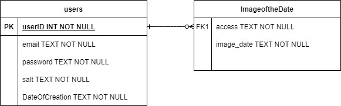

Nasa Image Finder

CS 484 final project.

## Table of Contents

- **[Build and Run](#build-and-run)**<br>
- **[Team Members](#team-members)**<br>
- **[Development Tools](#development-tools)**<br>

## Build and Run

From the root directory, run:

```
$ npm start
```

Once the server is running, you can navigate to [http://localhost:3000/](http://localhost:3000/) to use the application.


## Team Members

### Jan Kobylarz

- [jkobyl4@uic.edu](jkobyl4@uic.edu)
- [https://github.com/Jan3312](https://github.com/Jan3312)


## Development Tools

1. [Visual Studio Code](https://code.visualstudio.com/) to develop the project
2. [Git Bash](https://git-scm.com/) to launch the project
3. [Chrome](https://www.google.com/chrome/) to test the project
4. [GitHub](https://github.com/) to host the project


## Development Languages/frameworks
Front-end: JS, CSS, PUG, Bootstrap
Back-end: Node.js, Express, JS
Testing-tools: jest
Authentication: Passport.js


## ERD Diagram



